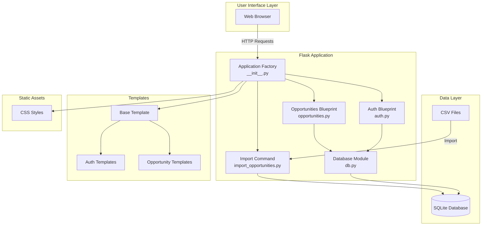
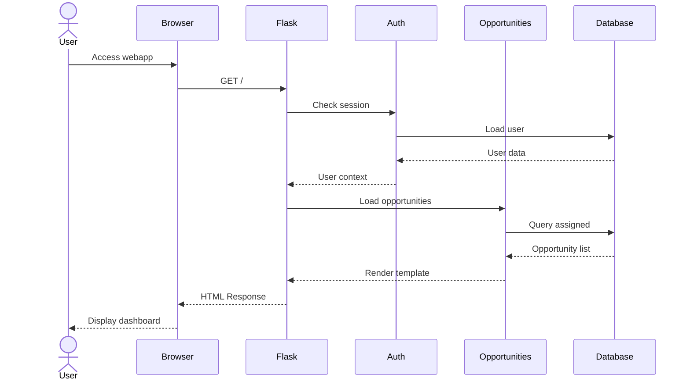
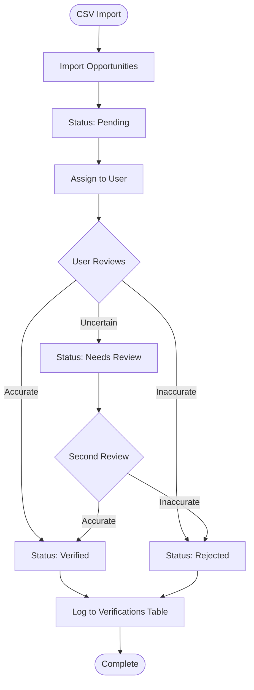
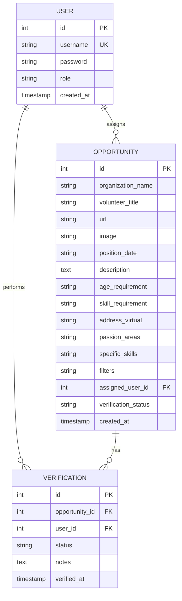
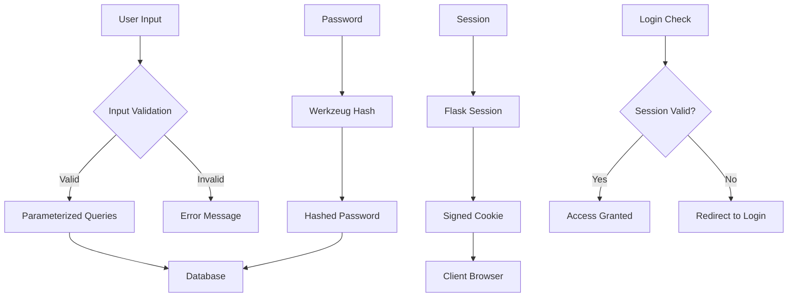
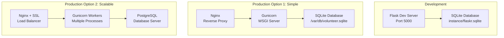
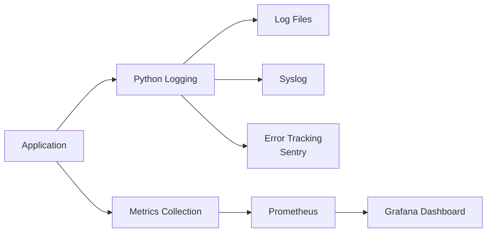
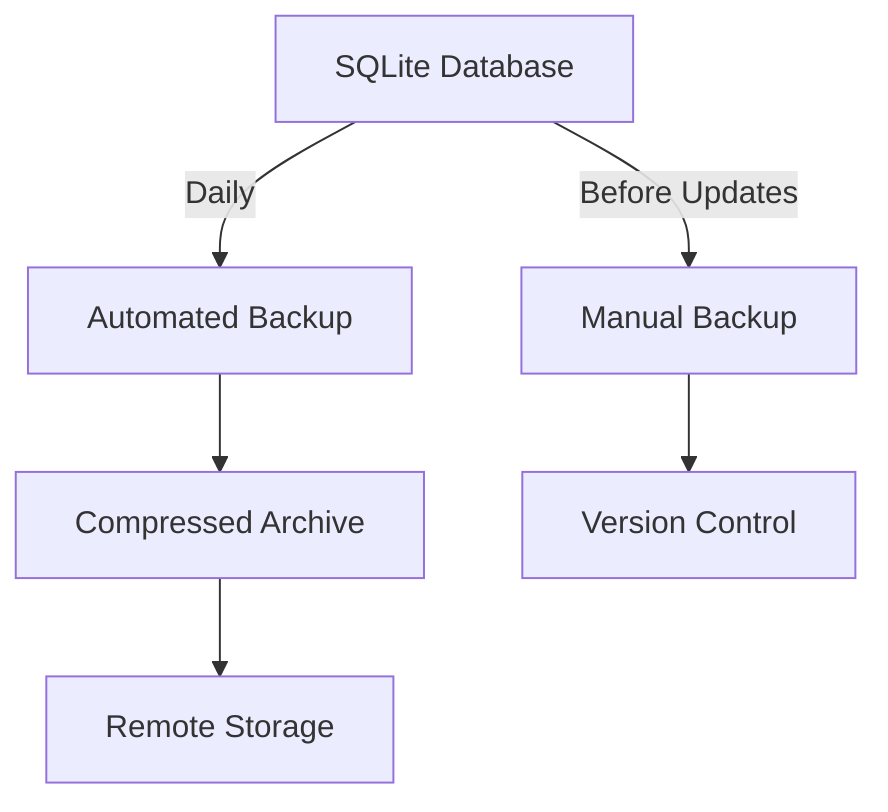

# Volunteer Connect Web Application Architecture

## System Overview



## Data Flow



## Verification Workflow



## Database Schema



## Component Interaction

```mermaid
graph LR
    subgraph "Request Handling"
        A[HTTP Request] --> B{Route}
        B -->|/auth/*| C[Auth Blueprint]
        B -->|/| D[Opportunities Blueprint]
        B -->|/*| D
    end
    
    subgraph "Authentication"
        C --> E[Check Credentials]
        E --> F[Session Management]
        F --> G{Valid?}
        G -->|Yes| H[Set g.user]
        G -->|No| I[Redirect to Login]
    end
    
    subgraph "Authorization"
        H --> J{@login_required}
        J -->|Authorized| K[Process Request]
        J -->|Unauthorized| I
    end
    
    subgraph "Data Access"
        K --> L[get_db]
        L --> M[Execute Query]
        M --> N[Return Results]
    end
    
    subgraph "Response"
        N --> O[Render Template]
        O --> P[HTTP Response]
    end
```

## File Structure

```
volunteerconnectco-webscraper/
├── webapp/                          # Main application directory
│   ├── __init__.py                 # Application factory
│   ├── auth.py                     # Authentication blueprint
│   ├── db.py                       # Database utilities
│   ├── opportunities.py            # Opportunities blueprint
│   ├── import_opportunities.py     # CSV import CLI command
│   ├── schema.sql                  # Database schema
│   ├── requirements.txt            # Python dependencies
│   ├── README.md                   # Technical documentation
│   ├── .env.example               # Configuration template
│   ├── .gitignore                 # Git ignore rules
│   ├── static/
│   │   └── style.css              # Application styles (700+ lines)
│   └── templates/
│       ├── base.html              # Base template with navigation
│       ├── auth/
│       │   ├── login.html        # Login page
│       │   └── register.html     # Registration page
│       └── opportunities/
│           ├── index.html        # User dashboard
│           ├── all.html          # All opportunities list
│           ├── detail.html       # Opportunity detail view
│           ├── verify.html       # Verification form
│           └── stats.html        # Statistics dashboard
├── run_webapp.sh                   # Automated startup script
├── QUICKSTART.md                   # User guide
├── WEBAPP_SUMMARY.md               # Implementation summary
├── ARCHITECTURE.md                 # This file
└── volunteer_output.csv            # Sample data for import
```

## Technology Stack

- **Backend**: Flask 3.0.0 (Python web framework)
- **Database**: SQLite (embedded database)
- **Security**: Werkzeug (password hashing, security utilities)
- **Frontend**: HTML5, CSS3, Vanilla JavaScript
- **Styling**: Custom CSS with CSS Variables
- **Templates**: Jinja2 (Flask's template engine)

## Security Architecture



## Deployment Architecture



## Key Design Decisions

### 1. Application Factory Pattern
- Allows multiple instances with different configs
- Facilitates testing
- Enables blueprint registration

### 2. Blueprint Architecture
- Separates concerns (auth vs. opportunities)
- Makes code more maintainable
- Enables modular development

### 3. SQLite Database
- Zero configuration
- Perfect for small-to-medium deployments
- Easy backup (single file)
- Can upgrade to PostgreSQL if needed

### 4. Status-Based Workflow
- Clear state transitions
- Audit trail via verifications table
- Flexible for future status additions

### 5. Server-Side Rendering
- Better SEO
- Faster initial load
- Progressive enhancement
- No complex build process

## Performance Characteristics

- **Database Queries**: Optimized with proper indexing on foreign keys
- **Page Load**: Fast with minimal external dependencies
- **Scalability**: Can handle 100s of concurrent users with proper deployment
- **Storage**: ~1-2KB per opportunity record

## Extension Points

The architecture supports easy extension for:

1. **API Layer**: Add RESTful API blueprint
2. **Admin Interface**: Create admin blueprint with permissions
3. **Email System**: Integrate Flask-Mail
4. **File Uploads**: Add file handling for opportunity images
5. **Search**: Integrate full-text search
6. **Caching**: Add Redis for session/data caching
7. **Background Jobs**: Integrate Celery for async tasks

## Monitoring & Logging

Recommended additions for production:



## Backup Strategy



---

This architecture provides a solid foundation for a production-ready volunteer opportunity verification system while maintaining simplicity and ease of deployment.
