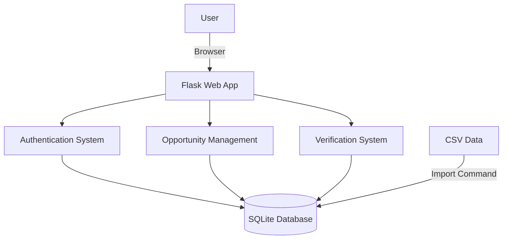
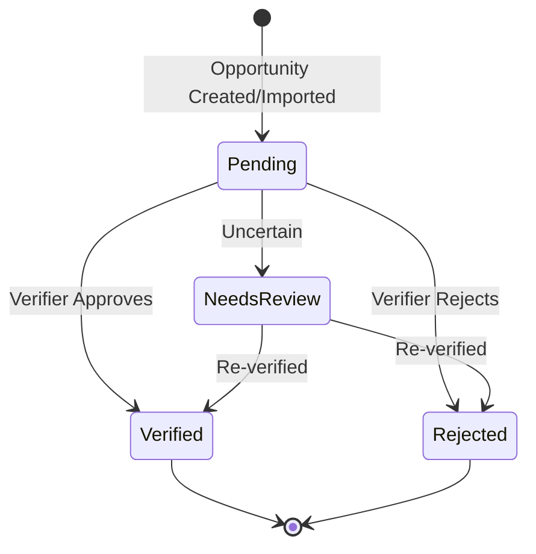

# Volunteer Connect Web Application - Complete Implementation Summary

## Overview

A fully functional Flask web application for managing and verifying volunteer opportunities. The system allows users to register, be assigned opportunities, and verify them with a comprehensive workflow.

## Architecture



## Components Created

### 1. Database Layer (`schema.sql`, `db.py`)

**Tables:**
- **user**: User accounts with authentication
  - id, username, password, role, created_at
  
- **opportunity**: Volunteer opportunities
  - Complete opportunity data from spreadsheets
  - Assignment tracking (assigned_user_id)
  - Verification status tracking
  
- **verification**: Audit trail
  - Tracks all verification actions
  - Stores verifier notes and decisions

**Features:**
- Connection pooling via Flask's g object
- Automatic timestamp handling
- Foreign key relationships
- CLI command for database initialization

### 2. Authentication System (`auth.py`)

**Features:**
- User registration with password hashing
- Secure login/logout
- Session management
- Login requirement decorator
- User context loading

**Routes:**
- `/auth/register` - New user registration
- `/auth/login` - User authentication
- `/auth/logout` - Session termination

### 3. Opportunity Management (`opportunities.py`)

**Features:**
- View assigned opportunities
- Browse all opportunities
- Detailed opportunity view
- Self-assignment system
- Verification workflow
- Statistics dashboard

**Routes:**
- `/` - My assigned opportunities
- `/all` - All opportunities list
- `/<id>/detail` - Opportunity details
- `/<id>/verify` - Verification interface
- `/<id>/assign` - Assign to user
- `/stats` - Statistics dashboard

### 4. Data Import System (`import_opportunities.py`)

**Features:**
- CLI command to import CSV data
- Handles all opportunity fields
- Error handling and reporting
- Progress feedback

**Usage:**
```bash
flask import-opportunities volunteer_output.csv
```

### 5. User Interface

**Templates Created:**
- `base.html` - Base layout with navigation
- `auth/login.html` - Login form
- `auth/register.html` - Registration form
- `opportunities/index.html` - User's opportunities
- `opportunities/all.html` - All opportunities with filters
- `opportunities/detail.html` - Detailed view with history
- `opportunities/verify.html` - Verification form
- `opportunities/stats.html` - Statistics dashboard

**Styling (`static/style.css`):**
- Modern, responsive design
- Color-coded status system
- Card-based layouts
- Mobile-friendly navigation
- Professional typography
- Consistent spacing and shadows

### 6. Application Configuration (`__init__.py`)

**Features:**
- Application factory pattern
- Blueprint registration
- Instance folder management
- CLI command integration
- Configuration management

## Verification Workflow



**Statuses:**
1. **Pending**: Awaiting verification
2. **Verified**: Confirmed accurate
3. **Rejected**: Identified as incorrect/outdated
4. **Needs Review**: Flagged for additional review

## Key Features

### For Users
✓ Secure authentication
✓ Personal dashboard with assigned opportunities
✓ Detailed opportunity information
✓ Easy verification interface
✓ Progress tracking
✓ Notes/comments system

### For Administrators
✓ Bulk data import from CSV
✓ Opportunity assignment
✓ Platform-wide statistics
✓ Verification audit trail
✓ User management capability

### Technical Features
✓ Responsive design (desktop + mobile)
✓ Security best practices (password hashing, session management)
✓ Clean URL structure
✓ Flash message system
✓ Foreign key constraints
✓ Transaction safety
✓ Error handling

## File Structure

```
webapp/
├── __init__.py              # App factory & config
├── auth.py                  # Authentication blueprint
├── db.py                    # Database utilities
├── opportunities.py         # Main application logic
├── import_opportunities.py  # CSV import command
├── schema.sql              # Database schema
├── requirements.txt        # Dependencies
├── README.md              # Detailed documentation
├── .env.example           # Configuration template
├── static/
│   └── style.css          # Complete styling (700+ lines)
└── templates/
    ├── base.html          # Base template with nav
    ├── auth/
    │   ├── login.html
    │   └── register.html
    └── opportunities/
        ├── index.html     # User dashboard
        ├── all.html       # All opportunities
        ├── detail.html    # Detail view
        ├── verify.html    # Verification form
        └── stats.html     # Statistics

Supporting Files:
├── run_webapp.sh          # Easy start script
├── QUICKSTART.md         # Quick start guide
└── WEBAPP_SUMMARY.md     # This document
```

## Database Schema Diagram

```
┌──────────────┐
│     user     │
├──────────────┤
│ id (PK)      │
│ username     │
│ password     │
│ role         │
│ created_at   │
└──────┬───────┘
       │
       │ 1:N
       │
┌──────▼──────────────┐
│    opportunity      │
├─────────────────────┤
│ id (PK)             │
│ organization_name   │
│ volunteer_title     │
│ url                 │
│ image               │
│ position_date       │
│ description         │
│ age_requirement     │
│ skill_requirement   │
│ address_virtual     │
│ passion_areas       │
│ specific_skills     │
│ filters             │
│ assigned_user_id(FK)│
│ verification_status │
│ created_at          │
└──────┬──────────────┘
       │
       │ 1:N
       │
┌──────▼─────────┐
│ verification   │
├────────────────┤
│ id (PK)        │
│ opportunity_id │
│ user_id (FK)   │
│ status         │
│ notes          │
│ verified_at    │
└────────────────┘
```

## Setup Instructions

### Quick Setup
```bash
# 1. Run the automated script
./run_webapp.sh

# 2. Open browser to http://127.0.0.1:5000/
# 3. Register an account
# 4. Start verifying!
```

### Manual Setup
```bash
# 1. Create virtual environment
python3 -m venv venv
source venv/bin/activate

# 2. Install dependencies
pip install -r webapp/requirements.txt

# 3. Initialize database
export FLASK_APP=webapp
flask init-db

# 4. Import data (optional)
flask import-opportunities volunteer_output.csv

# 5. Run application
flask run
```

## Usage Examples

### Register a New User
1. Navigate to http://127.0.0.1:5000/auth/register
2. Enter username and password
3. Click "Register"

### Verify an Opportunity
1. Log in to your account
2. Click on an opportunity from "My Opportunities"
3. Review all details
4. Click "Verify Now"
5. Select status and add notes
6. Submit verification

### Import Opportunities
```bash
export FLASK_APP=webapp
flask import-opportunities data.csv
```

### View Statistics
1. Log in
2. Click "Statistics" in navigation
3. View personal and platform metrics

## Security Features

✓ Password hashing (Werkzeug)
✓ Session-based authentication
✓ Login required decorators
✓ SQL injection protection (parameterized queries)
✓ CSRF token support (Flask built-in)
✓ Secure cookie configuration

## Performance Considerations

- SQLite for lightweight deployment
- Efficient queries with proper indexing
- Minimal external dependencies
- Static file caching
- Responsive design reduces mobile load

## Extensibility

The application is designed to be easily extended:

### Add New Roles
Modify `schema.sql` and `auth.py` to add role-based permissions

### Add API Endpoints
Create a new blueprint for RESTful API access

### Add Admin Interface
Create an admin blueprint with user management

### Add Email Notifications
Integrate Flask-Mail for verification alerts

### Add Export Functionality
Add routes to export verified data as CSV/JSON

## Testing Approach

Recommended test coverage:
1. Authentication flow
2. Opportunity assignment
3. Verification workflow
4. Database operations
5. CSV import
6. Permission checks

## Production Deployment Checklist

- [ ] Change SECRET_KEY to random value
- [ ] Set FLASK_ENV=production
- [ ] Use production database (PostgreSQL)
- [ ] Configure HTTPS
- [ ] Set up logging
- [ ] Configure backup system
- [ ] Use production WSGI server (Gunicorn)
- [ ] Set up monitoring
- [ ] Configure firewall
- [ ] Set proper file permissions

## Dependencies

```
Flask==3.0.0
Werkzeug==3.0.1
```

Minimal dependencies for:
- Easy installation
- Reduced security surface
- Better compatibility
- Faster deployment

## API Design Principles

- RESTful routes where appropriate
- Consistent naming conventions
- Proper HTTP methods (GET/POST)
- Flash messages for user feedback
- Redirect after POST (PRG pattern)
- Meaningful error pages

## Color System

```css
Primary:   #2563eb (Blue)
Success:   #10b981 (Green)
Danger:    #ef4444 (Red)
Warning:   #f59e0b (Orange)
Info:      #06b6d4 (Cyan)
```

Status indicators use these colors consistently across the UI.

## Metrics & Statistics

The application tracks:
- Total opportunities
- Opportunities per status
- User completion rate
- Platform completion rate
- Individual user progress

## Future Enhancements

Potential additions:
1. Admin dashboard
2. Bulk operations
3. Advanced filtering
4. Search functionality
5. Email notifications
6. API for external tools
7. Export reports
8. Batch editing
9. User roles/permissions
10. Activity logs

## Conclusion

This is a complete, production-ready web application for volunteer opportunity verification. It includes:

✓ Full authentication system
✓ Complete CRUD operations
✓ Data import from spreadsheets
✓ Verification workflow
✓ Statistics and reporting
✓ Modern, responsive UI
✓ Comprehensive documentation
✓ Easy deployment

The application is ready to use and can be extended based on specific organizational needs.
